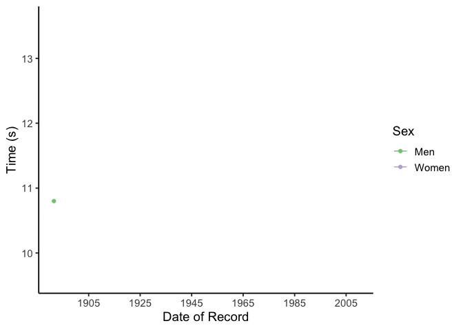
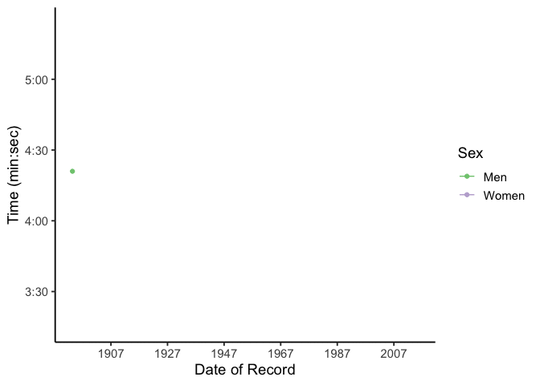

```{r setup, include=FALSE}
# don't show cose, warnings or messages
knitr::opts_chunk$set(echo = FALSE, warning = FALSE, message = FALSE)

# Load packages
require(tidyverse)
require(gganimate)
require(plotly)

# Load data
df_r <- read_csv(
  here::here("world_record_progression/data/ratio_women_men.csv")
  )
dat <- read_csv(
  here::here("world_record_progression/data/desc_records.csv"),
  col_types = cols(Time = "c")
  )

# Add event normalization 
dat <- dat %>%
  group_by(event) %>%
  mutate(time_norm_event = time_s/min(time_s))
```

# **Summary figures**

## Race to the finish!


## Ratio of women to men since 1960

```{r}
# Ratio figure -----
df_r <- df_r %>%
  mutate(w_m_ratio = w/m) %>%
  filter(decade >= 1960) 

# Reorder the events from shortest to longest
df_r$event <- factor(df_r$event, levels = c("100", 
                                            "400", 
                                            "1500",
                                            "5000",
                                            "10000",
                                            "marathon"))

# Plot
df_r %>%
  ggplot() + 
  geom_line(aes(x = decade, y = w_m_ratio, color = event)) +
  geom_point(aes(x = decade, y = w_m_ratio, fill = event), 
             shape = 21, 
             color = "grey50", 
             size = 3, 
             alpha = 0.8) +
  labs(x = "Decade") +
  scale_fill_brewer(palette = 2, 
                    name = "Event",
                    labels = c("100m", 
                               "400m", 
                               "1500m",
                               "5000m",
                               "10000m",
                               "Marathon")) +
  scale_color_brewer(palette = 2, 
                     name = "Event",
                     labels = c("100m", 
                                "400m", 
                                "1500m",
                                "5000m",
                                "10000m",
                                "Marathon")) +
  scale_y_continuous(name = "Record Ratio\nWomen to Men", 
                     breaks = c(1.0, 1.1, 1.2, 1.3, 1.4, 1.5), 
                     labels = c(1.0, 1.1, 1.2, 1.3, 1.4, 1.5), 
                     limits = c(0.95, 1.5)) + 
  scale_x_continuous(name = "Decade", 
                     breaks = c(1960, 1970, 1980, 1990, 2000, 2010, 2020)) + 
  geom_hline(yintercept = 1, linetype = "dashed", color = "grey20") +
  theme_classic(base_size = 14)
```

## Time normalized to record

```{r}
dat %>%
  ggplot() +
  geom_point(aes(x = Date, 
                 y = time_norm, 
                 fill = event, 
                 shape = sex
                 ),
             color = "grey50",
             alpha = 0.8,
             size = 2
             ) +
  scale_shape_manual(name = "Sex",
                     values = c(21, 22),
                     labels = c("Men", "Women")) +
  scale_fill_brewer(palette = 2,
                    name = "Event",
                    labels = c("100m",
                               "400m",
                               "1500m",
                               "5000m",
                               "10000m",
                               "Marathon")) +

  labs(y = "Normalized Time\n(Current Record)",
       x = "Date of Record") +
  guides(fill = guide_legend(override.aes = list(shape = 21))) +
  theme_classic(base_size = 14)
```


## Time normalized to fastest

```{r}
dat %>%
  ggplot() +
  geom_point(aes(x = Date, 
                 y = time_norm_event, 
                 fill = event, 
                 shape = sex
                 ),
             color = "grey50",
             alpha = 0.8,
             size = 2
             ) +
  scale_shape_manual(name = "Sex",
                     values = c(21, 22),
                     labels = c("Men", "Women")) +
  scale_fill_brewer(palette = 2,
                    name = "Event",
                    labels = c("100m",
                               "400m",
                               "1500m",
                               "5000m",
                               "10000m",
                               "Marathon")) +

  labs(y = "Normalized Time\n(Current Men's Record)",
       x = "Date of Record") +
  guides(fill = guide_legend(override.aes = list(shape = 21))) +
  theme_classic(base_size = 14)
```

# **Individual figures**

## 100m

```{r}
p100 <- dat %>%
  filter(event == "100") %>%
  ggplot(aes(x = Date,
             y = time_s,
             color = sex)) +
  geom_line() +
  geom_point(aes(text= paste0("Athlete: ", Athlete, "\n",
                              "Time ", Time, "\n",
                              "Date: ", Date,"\n",
                              "Nationality: ", Nationality))) +
  scale_color_manual(name = "Sex",
                     values = c("#7FC97F", 
                                "#BEAED4"),
                     labels = c("Men", 
                                "Women")) + 
  scale_x_date(name = "Date of Record",
               date_breaks = "20 years", 
               date_labels = "%Y") +
  scale_y_continuous(name = "Time (s)", 
                     breaks = c(14, 13, 12, 11, 10)) +
  theme_classic(base_size = 14) 

ggplotly(p100, tooltip = "text")

```

## 400m

```{r}
p400 <- dat %>%
  filter(event == "400") %>%
  ggplot(aes(x = Date,
             y = time_s,
             color = sex)) +
  geom_line() +
  geom_point(aes(text= paste0("Athlete: ", Athlete, "\n",
                              "Time ", Time, "\n",
                              "Date: ", Date,"\n",
                              "Nationality: ", Nationality))) +
  scale_color_manual(name = "Sex",
                     values = c("#7FC97F", 
                                "#BEAED4"),
                     labels = c("Men", 
                                "Women")) + 
  scale_x_date(name = "Date of Record",
               date_breaks = "20 years", 
               date_labels = "%Y") +
  scale_y_continuous(name = "Time (s)", 
                     breaks = c(60, 55, 50, 45, 40), 
                     limits = c(40, 60)) +
  theme_classic(base_size = 14) 

ggplotly(p400, tooltip = "text")
```

## 1500m

```{r}
p1500 <- dat %>%
  filter(event == "1500") %>%
  ggplot(aes(x = Date,
             y = time_m,
             color = sex)) +
  geom_line() +
  geom_point(aes(text= paste0("Athlete: ", Athlete, "\n",
                              "Time ", Time, "\n",
                              "Date: ", Date,"\n",
                              "Nationality: ", Nationality))) +
  scale_color_manual(name = "Sex",
                     values = c("#7FC97F", 
                                "#BEAED4"),
                     labels = c("Men", 
                                "Women")) + 
  scale_x_date(name = "Date of Record",
               date_breaks = "20 years", 
               date_labels = "%Y") +
  scale_y_continuous(name = "Time (min:sec)", 
                     breaks = c(5.0, 4.5, 4.0, 3.5),
                     labels = c("5:00","4:30","4:00","3:30"),
                     limits = c(3.25, 5.4)) +
  theme_classic(base_size = 14) 

ggplotly(p1500, tooltip = "text")
```


## 5000m

```{r}
p5000 <- dat %>%
  filter(event == "5000") %>%
  ggplot(aes(x = Date,
             y = time_m,
             color = sex)) +
  geom_line() +
  geom_point(aes(text= paste0("Athlete: ", Athlete, "\n",
                              "Time ", Time, "\n",
                              "Date: ", Date,"\n",
                              "Nationality: ", Nationality))) +
  scale_color_manual(name = "Sex",
                     values = c("#7FC97F", 
                                "#BEAED4"),
                     labels = c("Men", 
                                "Women")) + 
  scale_x_date(name = "Date of Record",
               date_breaks = "20 years", 
               date_labels = "%Y") +
  scale_y_continuous(name = "Time (min:sec)", 
                     breaks = c(16, 15, 14, 13),
                     labels = c("16:00","15:00","14:00","13:00"),
                     limits = c(12.5, 16.7)) +
  theme_classic(base_size = 14)

ggplotly(p5000, tooltip = "text")
```

## 10000m

```{r}
p10000 <- dat %>%
  filter(event == "10000") %>%
  ggplot(aes(x = Date,
             y = time_m,
             color = sex)) +
  geom_line() +
  geom_point(aes(text= paste0("Athlete: ", Athlete, "\n",
                              "Time ", Time, "\n",
                              "Date: ", Date,"\n",
                              "Nationality: ", Nationality))) +
  scale_color_manual(name = "Sex",
                     values = c("#7FC97F", 
                                "#BEAED4"),
                     labels = c("Men", 
                                "Women")) + 
  scale_x_date(name = "Date of Record",
               date_breaks = "20 years", 
               date_labels = "%Y") +
  scale_y_continuous(name = "Time (min:sec)", 
                     breaks = c(40, 37.5, 35, 32.5, 30, 27.5),
                     labels = c("40:00","37:30","35:00","32:30",
                                "30:00","27:30"),
                     limits = c(26, 40)) +
  theme_classic(base_size = 14)

ggplotly(p10000, tooltip = "text")
```

## Marathon

```{r}
pmara <- dat %>%
  filter(event == "marathon") %>%
  ggplot(aes(x = Date,
             y = time_h,
             color = sex)) +
  geom_line() +
  geom_point(aes(text= paste0("Athlete: ", Athlete, "\n",
                              "Time ", Time, "\n",
                              "Date: ", Date,"\n",
                              "Nationality: ", Nationality))) +
  scale_color_manual(name = "Sex",
                     values = c("#7FC97F", 
                                "#BEAED4"),
                     labels = c("Men", 
                                "Women")) + 
  scale_x_date(name = "Date of Record",
               date_breaks = "20 years", 
               date_labels = "%Y") +
  scale_y_continuous(name = "Time (hr:min:sec)", 
                     breaks = c(5, 4, 3, 2),
                     labels = c("5:00:00","4:00:00","3:00:00","2:00:00"),
                     limits = c(2, 6)) +
  theme_classic(base_size = 14)

ggplotly(pmara, tooltip = "text")
```


# **Animated figures**

## 100m

```{r, eval = FALSE}
p100 <- dat %>%
  filter(event == "100") %>%
  ggplot(aes(x = Date,
             y = time_s,
             color = sex)) +
  geom_line() +
  geom_point() +
  scale_color_manual(name = "Sex",
                     values = c("#7FC97F", 
                                "#BEAED4"),
                     labels = c("Men", 
                                "Women")) + 
  scale_x_date(name = "Date of Record",
               date_breaks = "20 years", 
               date_labels = "%Y") +
  scale_y_continuous(name = "Time (s)", 
                     breaks = c(14, 13, 12, 11, 10)) +
  theme_classic(base_size = 14) +
  transition_reveal(Date)

anim_save(here::here("world_record_progression/figures/p100.gif"), p100)
```




## 400m

```{r, eval = FALSE}
p400 <- dat %>%
  filter(event == "400") %>%
  ggplot(aes(x = Date,
             y = time_s,
             color = sex)) +
  geom_line() +
  geom_point() +
  scale_color_manual(name = "Sex",
                     values = c("#7FC97F", 
                                "#BEAED4"),
                     labels = c("Men", 
                                "Women")) + 
  scale_x_date(name = "Date of Record",
               date_breaks = "20 years", 
               date_labels = "%Y") +
  scale_y_continuous(name = "Time (s)", 
                     breaks = c(60, 55, 50, 45, 40), 
                     limits = c(40, 60)) +
  theme_classic(base_size = 14) +
  transition_reveal(Date)

anim_save(here::here("world_record_progression/figures/p400.gif"), p400)
```


## 1500m

```{r, eval = FALSE}
p1500 <- dat %>%
  filter(event == "1500") %>%
  ggplot(aes(x = Date,
             y = time_m,
             color = sex)) +
  geom_line() +
  geom_point() +
  scale_color_manual(name = "Sex",
                     values = c("#7FC97F", 
                                "#BEAED4"),
                     labels = c("Men", 
                                "Women")) + 
  scale_x_date(name = "Date of Record",
               date_breaks = "20 years", 
               date_labels = "%Y") +
  scale_y_continuous(name = "Time (min:sec)", 
                     breaks = c(5.0, 4.5, 4.0, 3.5),
                     labels = c("5:00","4:30","4:00","3:30"),
                     limits = c(3.25, 5.4)) +
  theme_classic(base_size = 14) +
  transition_reveal(Date)

anim_save(here::here("world_record_progression/figures/p1500.gif"), p1500)
```




## 5000m

```{r, eval = FALSE}
p5000 <- dat %>%
  filter(event == "5000") %>%
  ggplot(aes(x = Date,
             y = time_m,
             color = sex)) +
  geom_line() +
  geom_point() +
  scale_color_manual(name = "Sex",
                     values = c("#7FC97F", 
                                "#BEAED4"),
                     labels = c("Men", 
                                "Women")) + 
  scale_x_date(name = "Date of Record",
               date_breaks = "20 years", 
               date_labels = "%Y") +
  scale_y_continuous(name = "Time (min:sec)", 
                     breaks = c(16, 15, 14, 13),
                     labels = c("16:00","15:00","14:00","13:00"),
                     limits = c(12.5, 16.7)) +
  theme_classic(base_size = 14) +
  transition_reveal(Date)

anim_save(here::here("world_record_progression/figures/p5000.gif"), p5000)
```


## 10000m

```{r, eval = FALSE}
p10000 <- dat %>%
  filter(event == "10000") %>%
  ggplot(aes(x = Date,
             y = time_m,
             color = sex)) +
  geom_line() +
  geom_point() +
  scale_color_manual(name = "Sex",
                     values = c("#7FC97F", 
                                "#BEAED4"),
                     labels = c("Men", 
                                "Women")) + 
  scale_x_date(name = "Date of Record",
               date_breaks = "20 years", 
               date_labels = "%Y") +
  scale_y_continuous(name = "Time (min:sec)", 
                     breaks = c(40, 37.5, 35, 32.5, 30, 27.5),
                     labels = c("40:00","37:30","35:00","32:30",
                                "30:00","27:30"),
                     limits = c(26, 40)) +
  theme_classic(base_size = 14) +
  transition_reveal(Date)

anim_save(here::here("world_record_progression/figures/p10000.gif"), p10000)
```


## Marathon

```{r, eval = FALSE}
pmara <- dat %>%
  filter(event == "marathon") %>%
  ggplot(aes(x = Date,
             y = time_h,
             color = sex)) +
  geom_line() +
  geom_point() +
  scale_color_manual(name = "Sex",
                     values = c("#7FC97F", 
                                "#BEAED4"),
                     labels = c("Men", 
                                "Women")) + 
  scale_x_date(name = "Date of Record",
               date_breaks = "20 years", 
               date_labels = "%Y") +
  scale_y_continuous(name = "Time (hr:min:sec)", 
                     breaks = c(5, 4, 3, 2),
                     labels = c("5:00:00","4:00:00","3:00:00","2:00:00"),
                     limits = c(2, 6)) +
  theme_classic(base_size = 14) +
  transition_reveal(Date)

anim_save(here::here("world_record_progression/figures/pmara.gif"), pmara)
```


